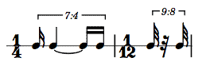

# LilyCollider

A class library for SuperCollider, providing support for Lilypond score generation. Original code by Bernardo Barros. Modifications by Hanns Holger Rutz. Published under the GNU General Public License.

## Preparations

On OS X, to be able to launch lilypond from the terminal (i.e. SuperCollider), the executable is `/Applications/Lilypond.app/Contents/Resources/bin/lilypond`. However it seems necessary to cd into the `Resources` directory first, in order for Lilypond to find extra files. Therefore, you can use the `lilypond` shell script in this repository as a replacement for the executable. E.g.

    $ mv lilypond ~/bin/
    
(Assuming that `~/bin` is in the `$PATH`).

If not on `$PATH`, instead you can set `LilyShowableObj.lilyCmd`

Furthermore, the classes expect to find the templates in `Platform.userExtensionDir ++ "/LilyCollider/templates"`. If this does not apply to your installation, make sure to configure `LilyShowableObj.templatesFolder`. The PDF viewer defaults to `open` which works on OS X. On Linux you may need to adjust `LilyShowableObj.pdfViewer`.

## Rhythmic cells

The rhythmic cells now allow to break out of the 1/8 grid and add support for pauses and ties.

For example:

```SuperCollider
    
    a = RhythmicCell([2, [1, 5, 1]]);
    b = RhythmicCell([2/3, [1, -1, 1]]);
    [a, b].asRhythmicSeq.plot;
```

Cell `a` has length 2/8, while cell `b` has length 2/(3*8) = 1/12. In cell `a`, the element `5` is split into 4 + 1 which are tied. In cell `b`, the negative element `-1` is interpreted as a pause lasting for 1 unit.


